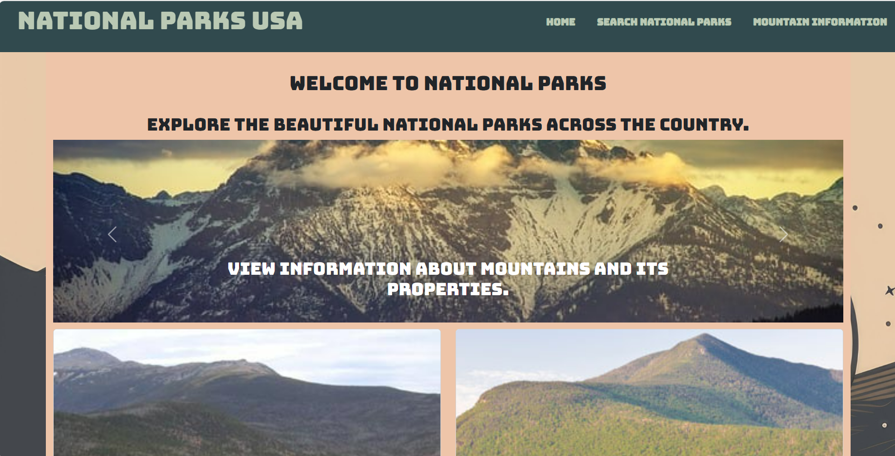
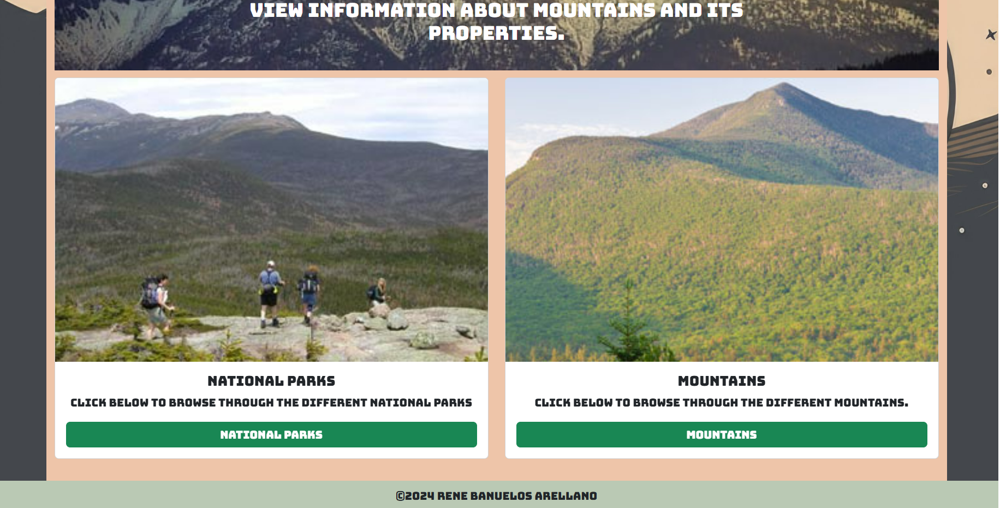
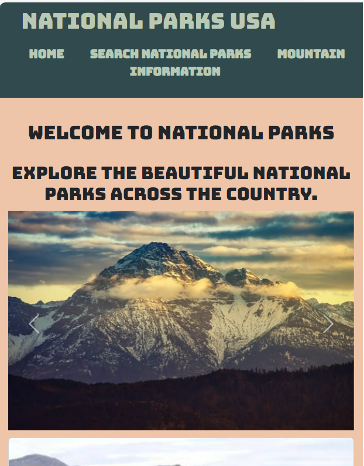
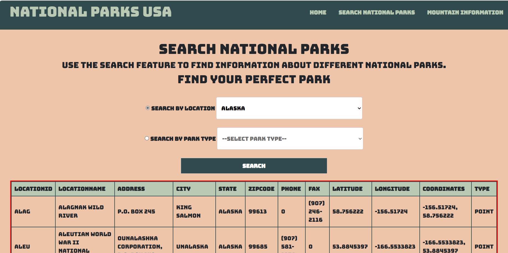
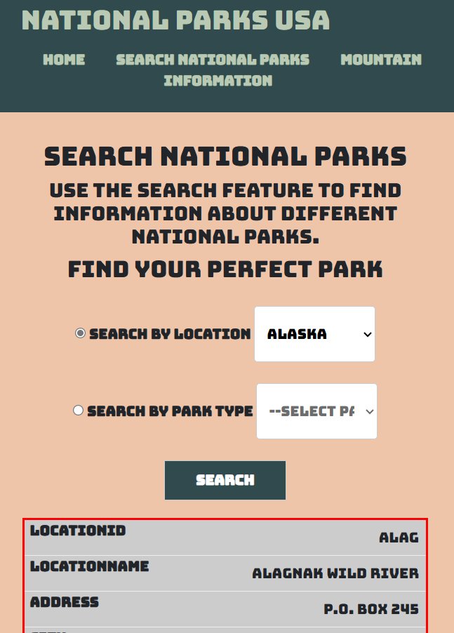
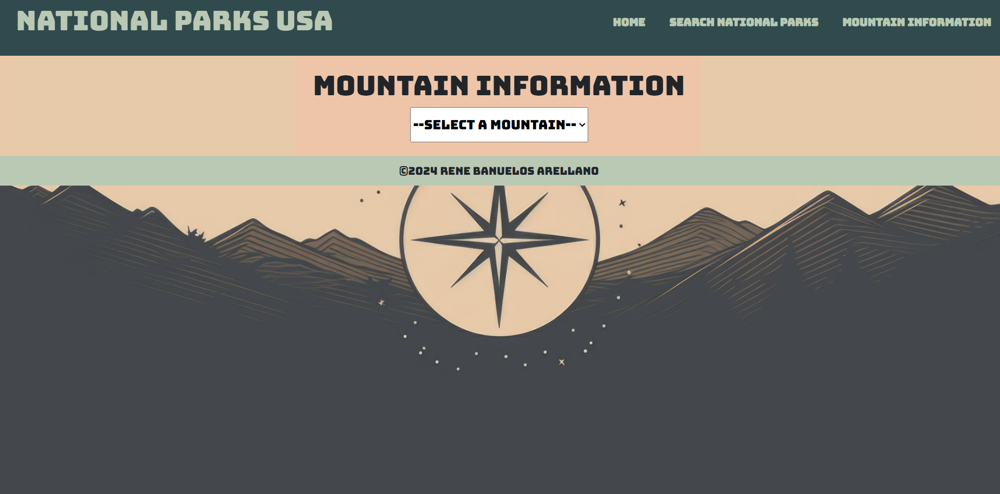
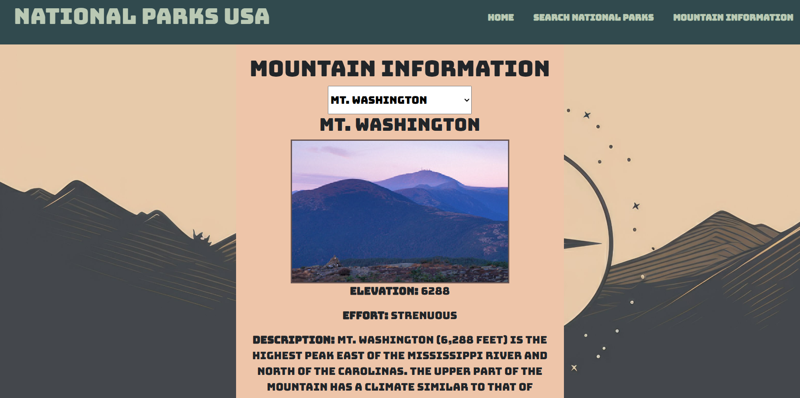
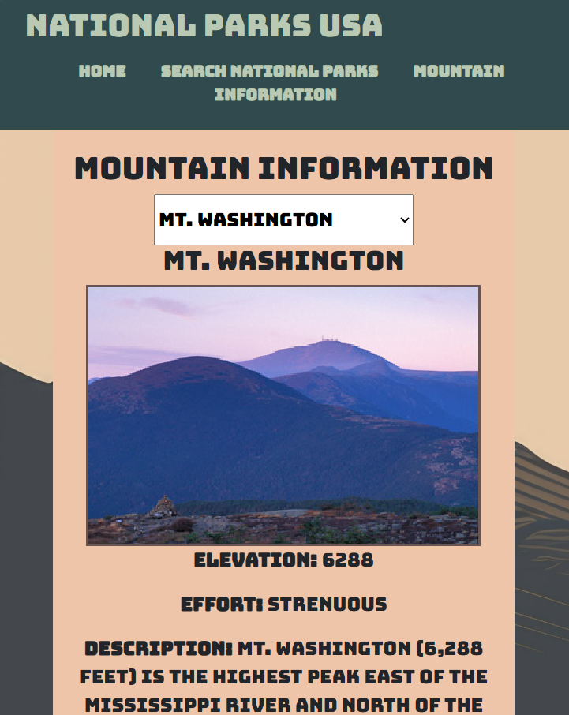
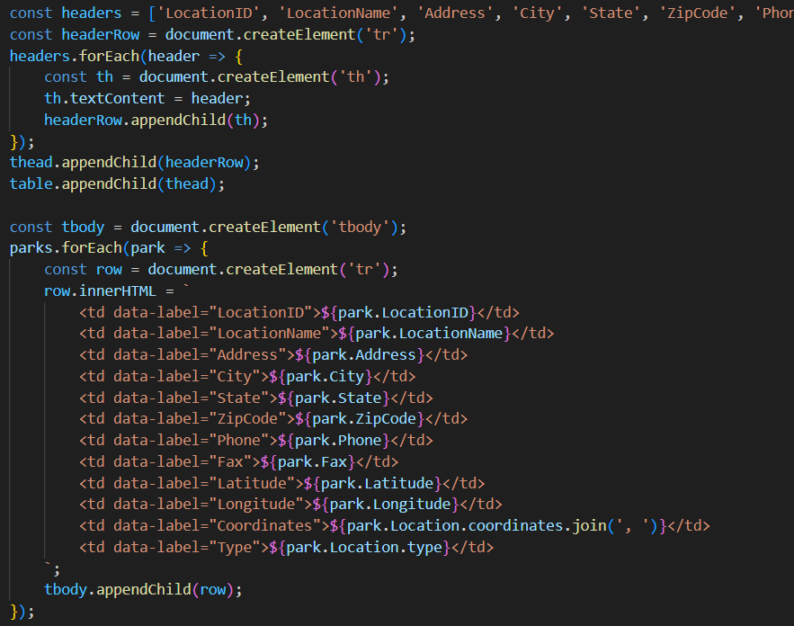

# capstone2
 capstone2

This is my national parks web project. It consists of a few pages which includes a home page, mountain information page,
and a search national parks page.

# Home page

    
    
     
    <h5>Minimized screen<h5>
    
 

# Search National Parks page

    
      
    <h5>Minimized screen<h5>
    

# Mountain Information page

    
    
     
    <h5>Minimized screen<h5>
    

#

One interesting piece of code within this project. Id say is the table styles from my javascript, I was going to try to implement styles via javascript, but ive read its better practice to style these components using css.

 

    
 
